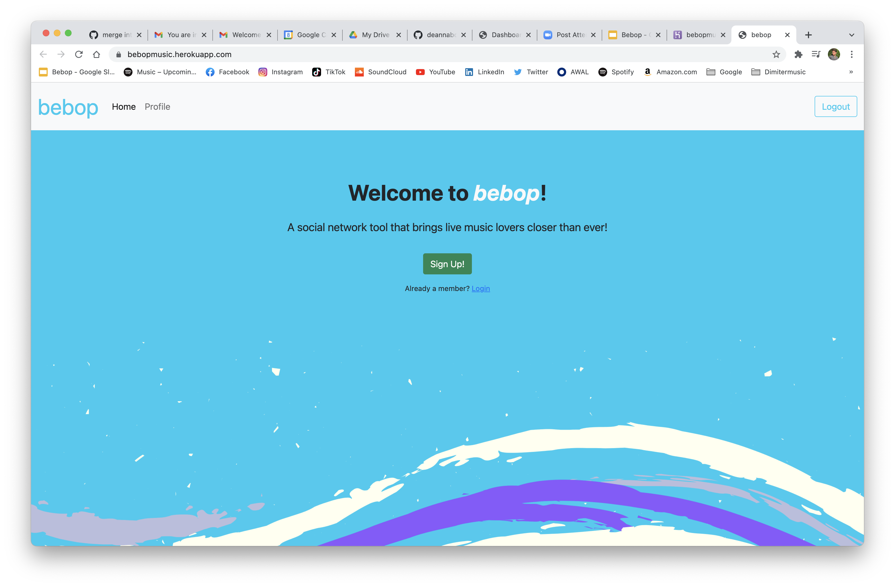
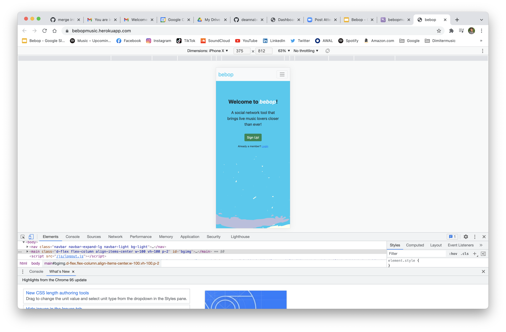
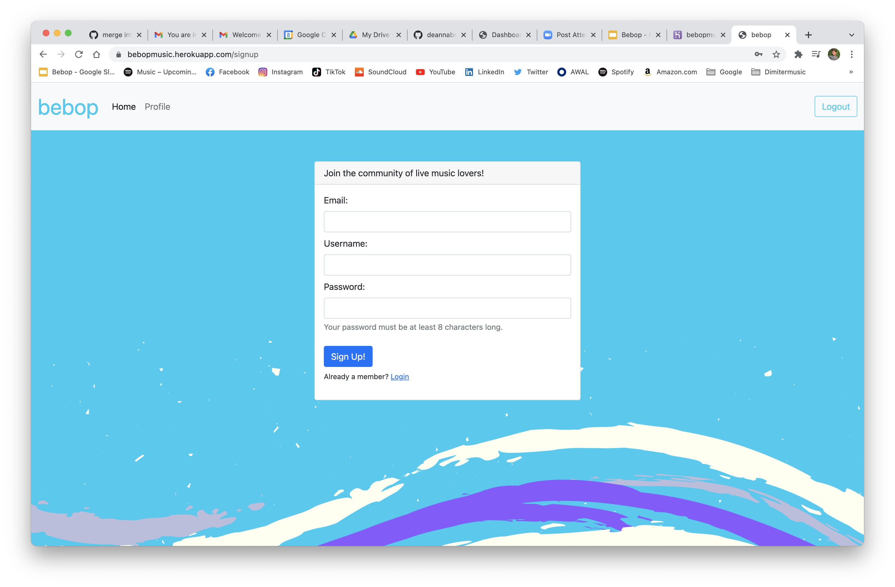
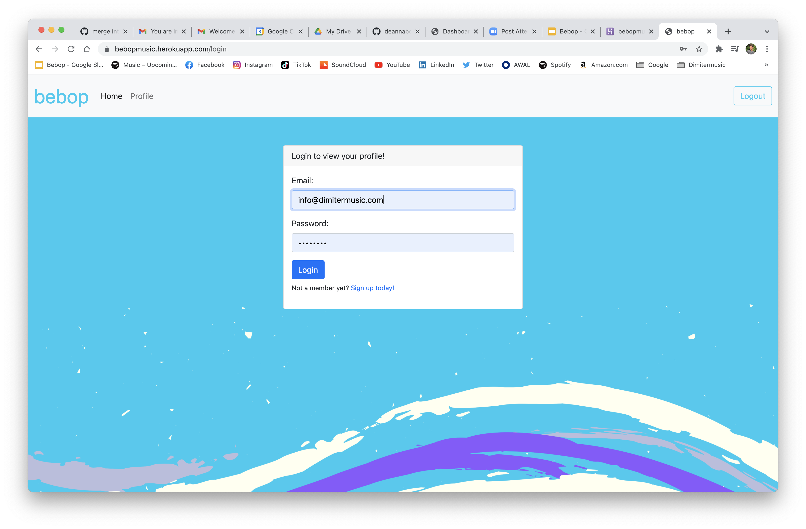
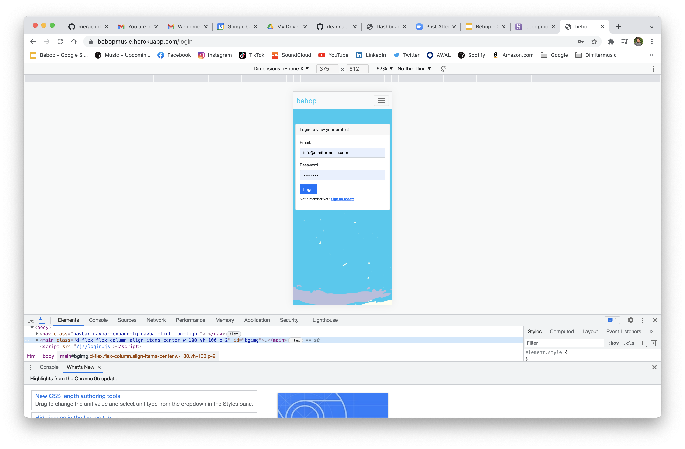
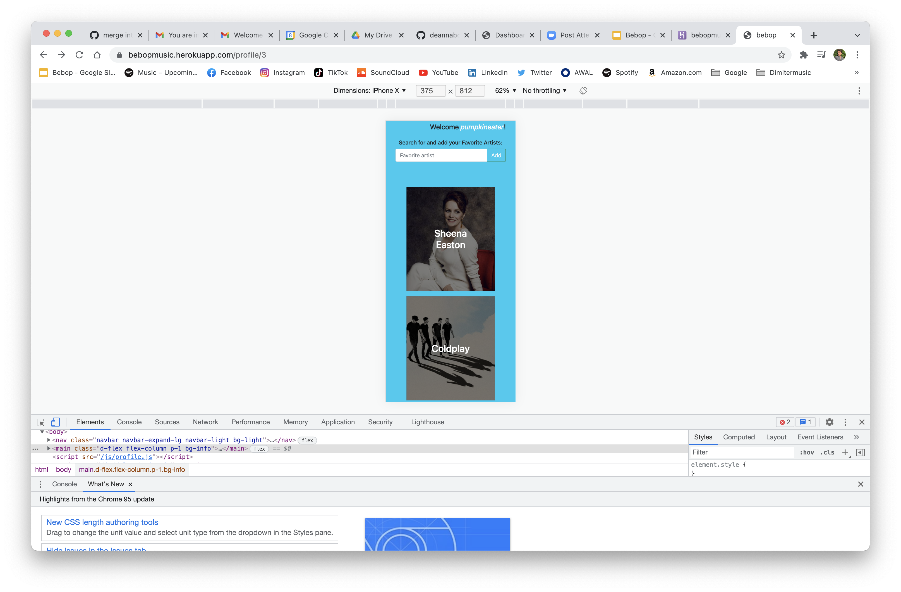
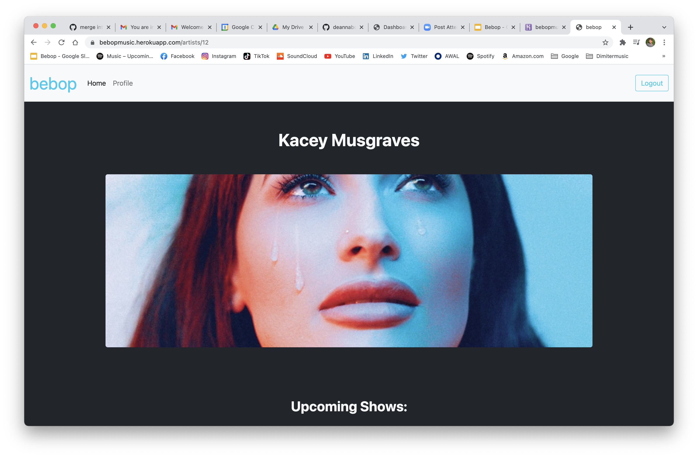
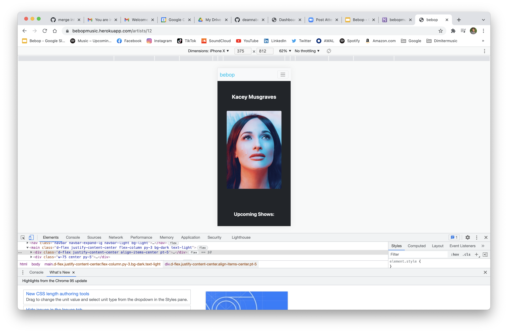

# Bebop Music 

## Description
A social networking tool that brings live music lovers closer than ever!

## Table of Contents
- [Bebop Music]
  - [Description](#description)
  - [Table of Contents](#table-of-contents)
  - [Installation](#installation)
  - [Usage](#usage)
  - [Contributing](#contributing)
  - [License](#license)
  - [Questions](#questions)

## Installation
Visit the app [here!](https://bebopmusic.herokuapp.com/)

## Usage
### Screenshots (Desktop and Mobile)

## Contributing
To contribute, contact us below!

## License
This application is covered under the MIT License

## Links
[Repository](https://github.com/deannaboiani/bebop)  
[Deployed App](https://bebopmusic.herokuapp.com/)

## Questions
If you have any questions, please visit my Github profile or email me using the links below

[Github](https://github.com/dimitermusic)  
[Email](mailto:info@dimitermusic.com)